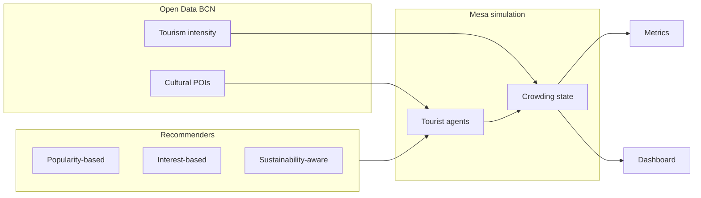

# Sustainable Tourism Recommender — Agent-Based Evaluation

This project evaluates POI recommendation strategies for tourism in Barcelona using an agent-based simulation. It compares three recommenders: popularity-based, interest-based, and sustainability-aware.

The main question is whether a recommender can reduce concentration around major tourist hotspots while still suggesting places that are relevant to visitors.

The system uses Open Data BCN for cultural POIs and baseline tourism intensity, Mesa for the simulation, and Solara for the interactive dashboard.

## Overview

The project builds a simulation environment with 72 Barcelona POIs. In the baseline scenario, around 3000 tourist agents move through the city over several days. Each tourist receives recommendations, decides whether to visit or skip them, and contributes to the simulated crowding level of each POI.

The simulation is used to compare how different recommendation strategies affect:

* inequality in the distribution of visits;
* concentration around major hotspots;
* overall visit dispersion;
* recommendation relevance to tourist interests.

The dashboard provides two main views:

* **Simulation**: run scenarios, switch recommendation strategies, and inspect crowding and visit metrics.
* **Your trip**: compare recommendation cards for a personal tourist profile.

## Quick start

```bash
cd RecommenderSystem

python -m venv .venv
source .venv/bin/activate          # Windows: .venv\Scripts\activate

pip install -r requirements.txt
python scripts/build_data.py

python -m solara run src/viz/app.py:Page --port 8765
```

Open:

```text
http://127.0.0.1:8765
```

To stop a server running in the background:

```bash
lsof -ti :8765 | xargs kill
```

Use `kill -9` only if the process does not stop normally.

## Architecture



## Main components

### Data pipeline

The data pipeline filters and enriches Open Data BCN POIs. It adds tags, prices, popularity scores, capacity estimates, and baseline tourism intensity. Manual assumptions and overrides are stored in `data/enrichment/`.

Data provenance is documented in [`data/DATA_SOURCES.md`](data/DATA_SOURCES.md).

### Simulation

The simulation is implemented with Mesa. Each day follows the same logic:

1. recommend POIs;
2. accept or skip recommendations;
3. record visits;
4. update crowding;
5. apply end-of-day crowding decay.

### Recommenders

| Strategy             | Mechanism                                                                                                   |
| -------------------- | ----------------------------------------------------------------------------------------------------------- |
| Popularity-based     | Ranks POIs mainly by global popularity.                                                                     |
| Interest-based       | Matches POIs to tourist interest tags.                                                                      |
| Sustainability-aware | Combines interest match, tourism pressure, cultural relevance, affordability, and live crowding dispersion. |

## Scenarios

Scenario presets are defined in `config/scenarios.yaml`.

Main scenarios used in the report:

| Scenario            | Purpose                                                                           |
| ------------------- | --------------------------------------------------------------------------------- |
| `baseline`          | Standard mixed tourist population.                                                |
| `overtourism_peak`  | Stress test with more tourists, more days, and higher initial crowding.           |
| `seminar_religious` | Single-tourist case study for a religious, historical, and architectural profile. |

Additional scenarios are also available for exploration, such as `crowd_averse`, `budget_backpacker`, `family_with_kids`, and `sustainability_mission`.

## Commands

All commands assume the virtual environment is active.

| Task                      | Command                                                         |
| ------------------------- | --------------------------------------------------------------- |
| Run tests                 | `pytest -q`                                                     |
| Build POI data            | `python scripts/build_data.py`                                  |
| Launch dashboard          | `python scripts/launch_viz.py`                                  |
| Launch dashboard directly | `python -m solara run src/viz/app.py:Page --port 8765`          |
| Run batch simulation      | `python scripts/run_batch.py --scenario baseline`               |
| Summarise batch results   | `python scripts/summarize_batch_results.py --scenario baseline` |
| Plot batch results        | `python scripts/plot_batch_results.py --scenario baseline`      |
| Run report scenarios      | `bash run_scenarios_report.sh`                                  |
| Run case study            | `python scripts/run_case_study.py --scenario seminar_religious` |
| List scenarios            | `python scripts/run_scenario.py --list`                         |
| Compare scenarios         | `python scripts/run_scenario.py --compare`                      |

Batch results are saved in:

```text
data/processed/batch_results.csv
```

Scenario-specific tables and figures are saved under:

```text
report/<scenario>/
```

## Report reproduction

The written report uses two population scenarios and one single-tourist case study:

* `baseline`
* `overtourism_peak`
* `seminar_religious`

To reproduce the results included in the report, run:

```bash
chmod +x run_scenarios_report.sh
./run_scenarios_report.sh
```

The script runs the exact scenarios used in the report:

```bash
# Baseline scenario
python scripts/run_batch.py --scenario baseline
python scripts/summarize_batch_results.py --scenario baseline
python scripts/plot_batch_results.py --scenario baseline

# Overtourism peak scenario
python scripts/run_batch.py --scenario overtourism_peak
python scripts/summarize_batch_results.py --scenario overtourism_peak
python scripts/plot_batch_results.py --scenario overtourism_peak

# Religious tourist case study
python scripts/run_case_study.py --scenario seminar_religious
```

The batch simulations generate the quantitative results used for the baseline and overtourism tables. The case-study script generates the top recommendations for the fixed religious tourist profile.

## Project layout

```text
config/            # simulation.yaml, scenarios.yaml
data/raw/          # Open Data BCN inputs
data/processed/    # generated POI table and batch results
data/enrichment/   # manual assumptions and overrides
docs/              # report reproduction notes
report/            # generated report tables and figures
scripts/           # command-line entry points
src/               # data pipeline, recommenders, simulation, metrics, dashboard
tests/             # unit tests
```

## Data sources

| Dataset                   | Source                                                                                                    |
| ------------------------- | --------------------------------------------------------------------------------------------------------- |
| Cultural interest points  | [Open Data BCN](https://opendata-ajuntament.barcelona.cat/data/en/dataset/punts-informacio-turistica)     |
| Tourism intensity by area | [Open Data BCN](https://opendata-ajuntament.barcelona.cat/data/en/dataset/intensitat-activitat-turistica) |

Full source notes are available in [`data/DATA_SOURCES.md`](data/DATA_SOURCES.md).
