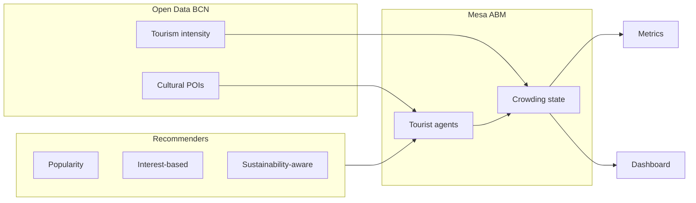

# Sustainable Tourism Recommender — Agent-Based Evaluation

An agent-based model of tourism in Barcelona that compares three POI recommendation strategies under real crowding dynamics. The system uses Open Data BCN for locations and baseline intensity, Mesa for simulation, and a Solara dashboard for interactive exploration.

The central question is distributional: whether a sustainability-aware recommender can spread visits across the city without hard exclusion rules — and how that compares to popularity-based or interest-based alternatives.

## Overview

Barcelona publishes both cultural points of interest and spatial tourism intensity. This project joins those sources into a simulation of roughly three thousand tourists moving through seventy-two POIs over several days. Each agent receives recommendations, may accept or skip them depending on crowding, and contributes to live load at each site.

The dashboard separates two views:

- **Simulation** — scenario, strategy, and agent population driving map metrics (Gini, hotspot share, visit counts).
- **Your trip** — a personal profile for recommendation cards and strategy comparison, independent of the simulated crowd.

## Quick start

```bash
cd RecommenderSystem
python -m venv .venv && source .venv/bin/activate
pip install -r requirements.txt
python scripts/build_data.py
python -m solara run src/viz/app.py:Page --port 8765
```

Open http://127.0.0.1:8765. Run the simulation, advance a few days, and switch between Popularity-based and Sustainability-aware to compare hotspot pressure on the map.

To stop a server left running in the background:

```bash
lsof -ti :8765 | xargs kill    # use :8766 if you started on that port
```

Use `kill -9` if the process does not exit.

## Architecture



**Data pipeline** — Raw POI records are filtered, tagged, enriched, and joined with baseline intensity. Assumptions and overrides are versioned in `data/enrichment/`. See [`data/DATA_SOURCES.md`](data/DATA_SOURCES.md) for provenance.

**Simulation** — `TourismModel` runs a daily loop: recommend, accept/reject, visit, update crowding, decay. POIs hold state; tourists are Mesa agents.

**Evaluation** — Batch runs compare strategies on Gini coefficient, hotspot visit share, entropy, and profile consistency. The dashboard exposes the same logic interactively.

## Recommender strategies

| Strategy | Mechanism |
|----------|-----------|
| Popularity-based | Ranks POIs by global fame; budget and distance filters apply. |
| Interest-based | Cosine similarity on interest tags; distance and crowding penalties. |
| Sustainability-aware | Multi-criteria score: interests, environment, culture, economy, and live crowding dispersion. |

Scenario presets in `config/scenarios.yaml` vary population size, crowd sensitivity, budget, and initial load. Examples include `baseline`, `seminar_religious`, `crowd_averse`, `budget_backpacker`, `family_with_kids`, `overtourism_peak`, and `sustainability_mission`.

## Setup

```bash
cd RecommenderSystem
python -m venv .venv
source .venv/bin/activate          # Windows: .venv\Scripts\activate
pip install -r requirements.txt
python scripts/build_data.py       # writes data/processed/pois_simulation.csv
```

## Commands

All commands assume the virtualenv is active.

| Task | Command |
|------|---------|
| Tests | `pytest -q` |
| Dashboard | `python scripts/launch_viz.py` |
| Dashboard (direct) | `python -m solara run src/viz/app.py:Page --port 8765` |
| Case study (no agents) | `python scripts/run_case_study.py --scenario seminar_religious` |
| Batch simulation | `python scripts/run_batch.py --scenario baseline` |
| **All scenarios + reports** | `python scripts/run_all_reports.py` |
| Table 3 summary | `python scripts/summarize_batch_results.py --scenario baseline` |
| List scenarios | `python scripts/run_scenario.py --list` |
| Compare all scenarios | `python scripts/run_scenario.py --compare` |

Batch output: `data/processed/batch_results.csv`.

## Report tables (reproducibility)

For the written report — especially **Table 3** (strategy comparison on the baseline scenario):

```bash
# One command: all batch scenarios → batch_results.csv + report/<scenario>/
python scripts/run_all_reports.py
```

Or step by step:

```bash
# 1. Run 3 strategies × 4 seeds (writes raw metrics)
python scripts/run_batch.py --scenario baseline

# 2. Table 3 (CSV + terminal markdown)
python scripts/summarize_batch_results.py --scenario baseline

# 3. Figure — bar chart for the report
python scripts/plot_batch_results.py --scenario baseline
```

`run_all_reports.py` runs **6 population scenarios** (excludes `seminar_religious`, which is a single-tourist case study). Use `--reports-only` to rebuild tables/figures from existing `batch_results.csv` without re-simulating.

Outputs in `report/baseline/`:

- `table3.csv` — paste into Word/Excel for Table 3
- `figure.png` / `figure.pdf` — insert as Figure 3

Full steps: [`docs/REPORT_TABLES.md`](docs/REPORT_TABLES.md).

## Scope and limitations

This is a policy counterfactual model, not a production recommender. There are no real visitor click logs; interest tags and sustainability rubric entries are documented assumptions, partially calibrated from the 2019 intensity layer. POI and intensity data come from different years — the fusion is described in [`data/DATA_SOURCES.md`](data/DATA_SOURCES.md). Results are intended for comparative analysis under stated assumptions, not point forecasting.

## Project layout

```
data/raw/          # Open Data BCN inputs
data/processed/    # Generated POI table, batch_results.csv
data/enrichment/   # YAML assumptions
report/            # Report tables and figures (table3.csv, figure.png per scenario)
docs/              # Report reproduction (REPORT_TABLES.md)
src/               # Pipeline, recommenders, simulation, metrics, viz
scripts/           # CLI entry points
tests/
config/            # simulation.yaml, scenarios.yaml
```

## Data sources

| Dataset | Link |
|---------|------|
| Cultural interest points | [Open Data BCN](https://opendata-ajuntament.barcelona.cat/data/en/dataset/punts-informacio-turistica) |
| Tourism intensity by area | [Open Data BCN](https://opendata-ajuntament.barcelona.cat/data/en/dataset/intensitat-activitat-turistica) |

Full citations: [`data/DATA_SOURCES.md`](data/DATA_SOURCES.md)
